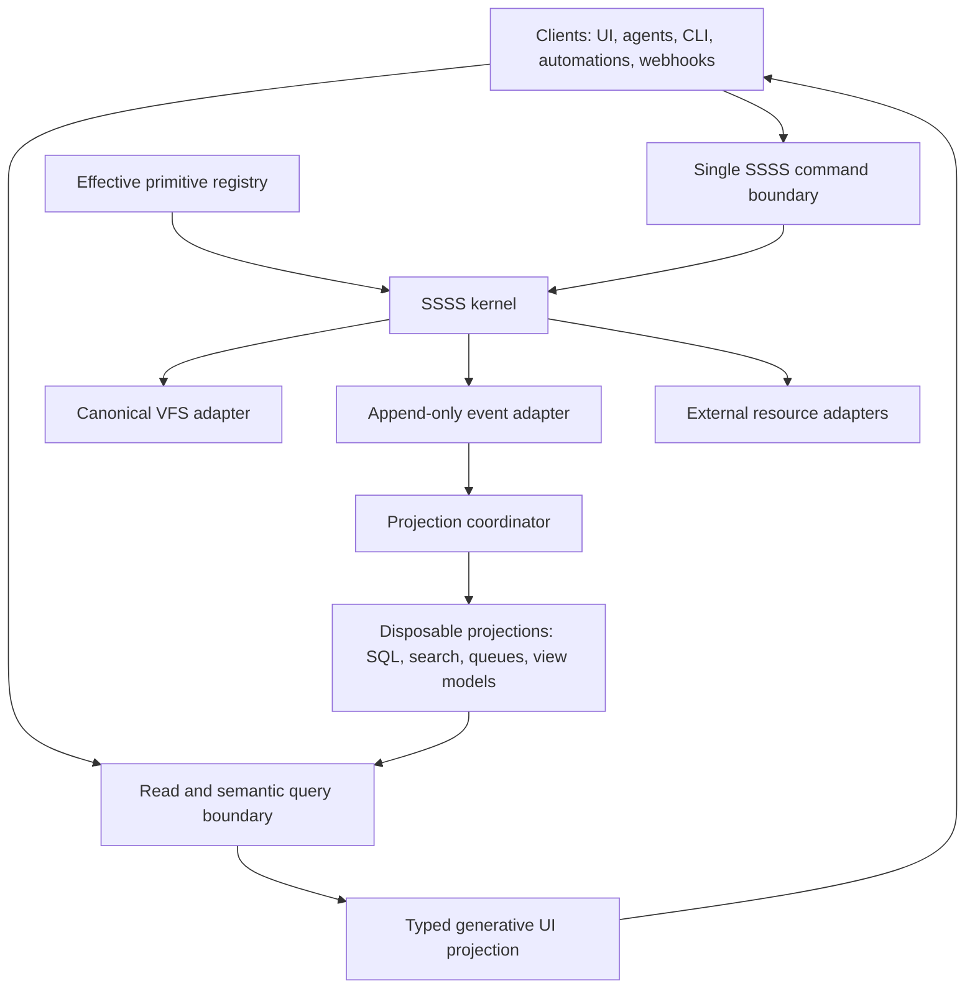

# SSSS_0_9_0_SEMANTIC_APPLICATION_KERNEL — Architecture

> **Project Prefix**: `SSSS_0_9_0_SEMANTIC_APPLICATION_KERNEL`
> **Kanban State**: 🏗️ In Progress
> **Author**: Greg Iteen and Codex
> **Date**: 2026-07-10

---

> **Authority:** Future-state design; current executable behavior remains defined by
> `registry/core.json`, `docs/ssss-spec.md`, conformance, and source until this plan lands.

## 0. Current State and Drift

The repository currently exposes a core registry, reference engine, frontmatter
codec, runtime planner, bundle/provisioning system, semantic WIP, CLI, and conformance
fixtures. Those capabilities are real but not yet one complete
host kernel.

The downstream implementations contain valuable behavior and unacceptable copies:

| Surface | Current strength | Current drift |
| --- | --- | --- |
| SSSS repo | Executable registry, reference engine, runtime, bundle, conformance | Host contracts incomplete; 0.8 localization direction conflicts with semantic vision |
| Total Recall | Detailed schemas, validated writes, filesystem memory, hybrid retrieval | Core schema and operation validation partially duplicated |
| Festech | Durable idempotency, leases, protected resources, event/SQL projection routing | Core registry and validator behavior copied into the host |
| UltraChat | Dynamic extensions, layered scopes, migrations, replay, drift detection | Large local schema/validator/registry stack duplicates core behavior |

0.9.0 harvests the strengths into package contracts and deletes the copies only
after each adapter proves parity.

### 0.1 Approved Phase 0 decisions

- Qualified primitive IDs use `namespace:type`; legacy unqualified core names remain
  migration aliases during 0.9 adoption.
- Public commands remain `operation`, `patch`, `event`, and `delete` for envelope
  compatibility; `kernel.execute` is the sole implementation.
- Package boundaries are the subpath exports listed in §2; adapters implement
  infrastructure mechanics and never redefine kernel semantics.
- Canonical events use stable IDs plus actor, scope, action, subject, correlation,
  causation, idempotency, primitive version, and before/after hashes.
- 0.8 translation overlays and localized vault materialization are removed. The
  deterministic semantic projection is retained and refactored around injected
  multilingual embedding and runtime rendering adapters.
- Registry constraint enforcement, deterministic extension composition, two-phase
  bundle preflight/import, privacy defaults, and semantic graph records are retained.
- Existing 0.8 user data is never silently rewritten. Migration runs in dry-run
  first, creates a backup manifest, diagnoses translation artifacts, and supports
  explicit rollback guidance.
- Host rollout flags are `SSSS_KERNEL_0_9_SHADOW`, `SSSS_KERNEL_0_9_ENABLED`, and
  `SSSS_GENERATIVE_UI_ENABLED`.
- 0.8.0 is deprecated only after 0.9.0 and all three host migrations are verified.

## 1. Target Topology



The kernel owns semantics and ordering. Adapters own infrastructure mechanics.

## 2. Package Boundaries

The existing package remains the release vehicle for 0.9.0, with stable subpath
exports. A later package split requires a separate decision.

| Export | Ownership |
| --- | --- |
| `/registry` | Core definitions, extension composition, namespaces, dependency locks |
| `/primitive` | Definition API, meta-schema, generated identifiers, migrations |
| `/validator` | Registry-driven data/document/envelope validation |
| `/kernel` | Mutation state machine and command execution |
| `/vfs` | VFS adapter interface and reference filesystem adapter |
| `/identity` | Verified-principal contract and authentication provenance |
| `/authorization` | Capabilities, policy floors, and fail-closed decision interface |
| `/leases` | Acquire, verify, renew, expire, and release semantics |
| `/events` | Canonical event envelope and append/replay contract |
| `/projections` | Subscription, cursor, rebuild, replay, and drift contracts |
| `/semantic` | Multilingual embedding, retrieval, and render-adapter contracts |
| `/ui` | Typed UI manifests, bindings, registered actions, validation |
| `/runtime` | Workflow planning and deterministic task/run/event derivation |
| `/bundle` | Portable extension, primitive, and resource packaging |
| `/conformance` | Kernel and adapter contract suites |

The CLI is a consumer of these exports, not a second implementation.

## 3. Registry Composition

### 3.1 Registry layers

```text
package core
  + installed extension packages
  + repository primitive definitions
  + workspace primitive definitions
  + authorized user primitive definitions
  = effective registry
```

Layers add definitions. They do not silently override a definition from another
layer. A compatible change uses the same namespace and a declared version upgrade;
an incompatible meaning uses a new qualified primitive ID.

### 3.2 Identity

Canonical identities are qualified and stable:

```text
ssss:workflow
festech:phone_number
ultrachat:workspace_template
acme:p_01JXYZ
```

Legacy plain type names may be accepted through explicit migration aliases, but
serialized bundles and new definitions use qualified IDs.

### 3.3 Primitive definition

A primitive definition is itself a governed document:

```yaml
type: ssss:primitive
primitive_id: acme:p_01JXYZ
namespace: acme
version: 1
name: 顧客予約
description: 顧客の予約日時と状態を管理します
language: ja
mutation: replace
portability: tenant_private
scopes: [workspace]
path_template: bookings/<id>.md
capabilities:
  create: [booking:create]
  read: [booking:read]
  update: [booking:update]
  delete: [booking:delete]
fields:
  - id: reservation_date
    name: 予約日
    kind: datetime
    required: true
  - id: status
    name: 状態
    kind: enum
    values: [pending, confirmed, canceled]
projections:
  - id: bookings
    strategy: event_driven
```

The natural-language definition is canonical in its authored language. Stable
field and capability IDs are machine controls; SSSS may generate them and users do
not need to author English identifiers.

### 3.4 Definition governance

- Creation and update require registry-management capabilities.
- System policy floors cannot be weakened by workspace/user definitions.
- Additive compatible changes may increment a revision.
- Breaking changes require a new version plus a migration plan.
- Active definitions and migrations are hash-locked in bundles and deployments.
- Unknown fields remain preservable for forward compatibility.

## 4. Skills Boundary

SSSS already supports `skill` as a document primitive, and skills may consume the
kernel like any other client. Standardizing repo-specific skill authoring,
distribution, discovery, or agent-host projection is not part of this 0.9.0 project.
That work requires a separate PRD if it becomes a priority. No 0.9.0 phase or release
gate depends on it.

## 5. Kernel Execution Model

All mutation transports call one function:

```ts
await kernel.execute({
  kind: 'patch',
  operation_id: 'op_...',
  idempotency_key: 'profile-update-123',
  workspace_id: 'acme',
  target: 'acme:profile/profiles/greg.md',
  patch: { timezone: 'America/Denver' },
});
```

The verified principal is injected by the transport adapter and overwrites any
caller-provided actor data.

### 5.1 Required stage order

```text
1. Decode and structurally validate command
2. Inject verified principal and request provenance
3. Resolve namespace, primitive version, scope, and safe VFS path
4. Compute canonical request hash and check idempotency
5. Evaluate authorization and policy floors
6. Verify required lease and optimistic concurrency preconditions
7. Read current state and validate transition
8. Prepare external-resource effects, when applicable
9. Commit canonical VFS mutation atomically
10. Append canonical event
11. Finalize or reconcile external-resource effect
12. Dispatch projection work
13. Return stable response or exact replay
```

No host may reorder or omit semantic stages. Adapters implement the invoked
mechanics only.

### 5.2 Transport

The reference HTTP transport exposes one primary command route, such as:

```text
POST /api/ssss/commands
```

Domain routes are allowed as typed façades but cannot write state. Reads use query
and projection endpoints and do not share mutation authority.

## 6. VFS Contract

```ts
interface SsssVfs {
  read(path, options): Promise<VersionedBytes | null>;
  stat(path): Promise<VfsStat | null>;
  list(prefix, options): AsyncIterable<VfsEntry>;
  writeAtomic(path, bytes, precondition): Promise<VfsCommit>;
  append(path, bytes, precondition): Promise<VfsCommit>;
  remove(path, precondition): Promise<VfsCommit>;
}
```

The kernel, not adapters, determines whether replace, append, patch, or delete is
legal. Every adapter must prove:

- workspace containment and canonical path normalization;
- no absolute path, traversal, backslash, null byte, or empty-segment ambiguity;
- symlink/reparse-point refusal or equivalent containment guarantees;
- atomic replace and append semantics;
- content hash/version preconditions;
- no partial commit on failed preflight.

## 7. Identity and Authorization

```ts
interface VerifiedPrincipal {
  id: string;
  kind: 'human' | 'agent' | 'service' | 'system';
  tenantId?: string;
  workspaceIds: string[];
  authentication: { provider: string; assurance: string };
}
```

Authorization evaluates a stable tuple:

```text
principal + capability + primitive + action + scope + target + context
```

Primitive definitions may require stronger capabilities, but they cannot bypass
kernel policy floors. AI-generated commands are never trusted based on self-declared
roles. Secret, financial, infrastructure, and account-root actions can require
step-up authentication or a human-confirmation lease.

## 8. Idempotency and Leases

The idempotency identity is:

```text
workspace_id + idempotency_key + canonical_request_hash
```

The same key and hash replays the original result. The same key with another hash
returns a conflict.

A lease binds:

```text
lease_id + workspace + target + principal + operation + issued_at + expires_at
```

Storage may be memory, filesystem, SQL, or a distributed coordinator, but observable
semantics are identical. Required lease state fails closed when absent or unreadable.

## 9. Canonical Events

Each committed mutation emits an immutable event containing:

- event ID, type, and schema version;
- timestamp from the injected clock;
- verified principal and authentication provenance;
- workspace, primitive ID/version, target path, and action;
- correlation, causation, operation, and idempotency identifiers;
- before/after content hashes and changed-field summary;
- external-resource reconciliation status where applicable.

Events are appended before projections are acknowledged. Projection failure is
recorded and retried; it does not rewrite canonical state or its event.

## 10. Projection Architecture

Primitive definitions and extensions declare projection subscriptions. The package
coordinator owns event filtering, cursor advancement, retry identity, replay, rebuild,
and drift comparison. Host adapters own the destination write.

```text
canonical event
  -> projection coordinator
  -> SQL adapter / search adapter / queue adapter / view-model adapter
  -> cursor + output hash
```

A projection can be deleted and rebuilt from canonical state and events. A direct
projection write that cannot be attributed to an event is drift.

## 11. Semantic and Language Architecture

SSSS stores one authored semantic source, in any language. It does not store required
translation variants.

```text
authorized source documents
  -> canonical semantic records
  -> one host-injected multilingual embedding adapter
  -> derived vector + lexical index
  -> cross-language retrieval
  -> host-injected LLM renderer with requested language
```

The renderer may output presentation fields only. It receives an invariant block
containing primitive ID, field IDs, enum codes, actions, permissions, paths, hashes,
and relations that it cannot modify. Semantic indexes record model identity and
dimension and are invalidated when either changes.

## 12. Generative UI Architecture

UI is a projection over authorized state, primitive definitions, available actions,
user intent, device context, accessibility needs, and presentation language.

The planner returns a typed manifest, not executable code:

```json
{
  "type": "ssss:ui_projection",
  "primitive": "festech:phone_number",
  "layout": "detail-with-actions",
  "components": [
    { "component": "status-card", "bind": "status" },
    { "component": "action-button", "action": "phone_number.release" }
  ]
}
```

The UI validator enforces:

- allowlisted components and properties;
- authorized field visibility;
- registered, capability-bound actions;
- safe bindings and output encoding;
- accessibility requirements;
- size and complexity limits;
- deterministic fallback rendering.

Every action maps back to a kernel command. The UI cannot mutate projections or
canonical state directly.

## 13. External Resource Coordination

External systems cannot always participate in an atomic filesystem transaction.
Resource adapters therefore use explicit states:

```text
validate -> prepare -> canonical intent commit -> perform/finalize -> reconcile
```

The event log records enough information to retry or compensate safely. Provider
webhooks are authenticated and normalized into event or reconciliation commands.
Secrets remain in a secret manager; SSSS stores references, access policy, hashes
where safe, and audit history.

## 14. Bundles and Dependency Resolution

Bundles declare:

- SSSS core version range;
- primitive namespace and version requirements;
- extension package versions and integrity hashes;
- required migrations and resource bindings;
- portability inventory and provenance.

Resolution is deterministic and lockable. Missing, conflicting, or untrusted
dependencies fail during preflight before the first mutation.

## 15. Migration Strategy

0.9.0 is adopted incrementally behind a host feature flag:

1. Add package kernel beside the host implementation.
2. Run shadow validation and compare verdicts without writing twice.
3. Convert host-only types into namespaced extension definitions.
4. Route one low-risk primitive family through the kernel.
5. Expand by primitive family while comparing events and projections.
6. Block direct writes and remove copied core validators/registries/fixtures.
7. Run clean-workspace, replay, recovery, and security verification.

Recommended host order:

1. Total Recall proves the reference filesystem and memory path.
2. Festech proves durable stores, protected resources, and SQL projections.
3. UltraChat proves dynamic extensions, layered scopes, replay, drift detection,
   and generative UI.

## 16. Conformance Architecture

The package ships independent suites for:

- primitive/registry composition;
- kernel commands and state transitions;
- VFS adapters;
- identity and authorization adapters;
- idempotency and lease stores;
- event stores and replay;
- projection adapters and drift detection;
- semantic/embedding/render adapters;
- UI manifests and action binding;
- bundles, migrations, and external resources;
- adversarial paths, symlinks, collisions, malformed state, and prompt injection.

Cross-host fixtures compare normalized semantic results rather than host-specific
storage details.

## 17. Architectural Invariants

- No canonical user-data mutation bypasses `kernel.execute`.
- No host owns a copied core registry, validator, fixture set, or Operation Contract.
- No projection is required to recover canonical meaning.
- No generated UI or retrieved instruction grants authority.
- No caller supplies trusted identity.
- No language variant changes symbolic controls.
- No private content enters semantic or UI planning without authorization.
- No primitive collision or breaking upgrade is resolved implicitly.
- No release is declared complete until all reference and host adapter suites pass.
